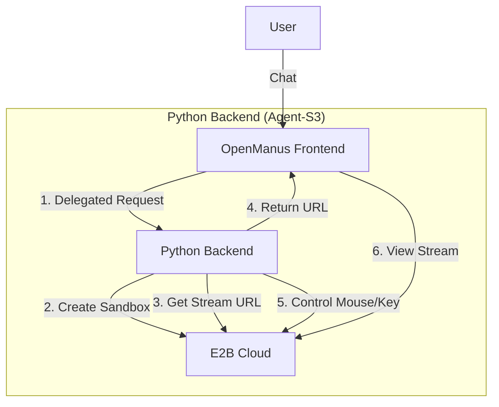

# OpenManus Project Blueprint: E2B Cloud Mode

## 1. Project Overview

**OpenManus** is a completely local Agent-S3 platform that uses **E2B Cloud** for safe sandboxing (as requested).

### Architecture
| Component    | Tech              | Role                          |
| ------------ | ----------------- | ----------------------------- |
| **Frontend** | Next.js (Surf)    | UI & E2B Stream Viewer        |
| **Backend**  | Python (Agent-S3) | The "Brain" (GPT-5 + UI-TARS) |
| **Sandbox**  | E2B Cloud         | The "Computer" (Ubuntu VM)    |

## 2. Updated System Architecture



## 3. Implementation Steps

### A. Backend (Python)
We create a new `E2BAdapter` that tricks Agent-S3 into controlling a remote E2B sandbox instead of the local mouse.

**`backend/agent/adapter.py`**:
```python
class E2BAdapter:
    def __init__(self, sandbox):
        self.sandbox = sandbox
    
    def click(self, x, y):
        self.sandbox.left_click(x, y)
        
    def type(self, text):
        self.sandbox.write(text)
        
    def press(self, key):
        self.sandbox.press(key)
```

**`backend/agent/wrapper.py`**:
- Initialize `Sandbox()` from `e2b_desktop`.
- Inject `E2BAdapter` into Agent-S3's environment.
- Pass the VNC Stream URL back to the API.

### B. Frontend (Next.js)
We modify the API route to simply **proxy** the request to our Python Backend.

**`frontend/app/api/chat/route.ts`** (New Logic):
1. Receive user message.
2. POST to `http://localhost:8000/chat`.
3. Receive `{ "status": "success", "stream_url": "..." }`.
4. Stream the text response to the chat UI.
5. Pass the `stream_url` to the BrowserView.

## 4. Agent-S3 Configuration

```bash
agent_s \
    --provider openai \
    --model gpt-5-2025-08-07 \
    --ground_provider vllm \
    --ground_url http://localhost:8080 \
    --ground_model ui-tars-1.5-7b
```

## 5. Development Roadmap

1.  **Backend**: Implement `E2BAdapter` & API endpoints.
2.  **Frontend**: Update `api/chat/route.ts` to call Backend.
3.  **Verify**: Click "Start", Backend creates E2B, Frontend shows stream.
